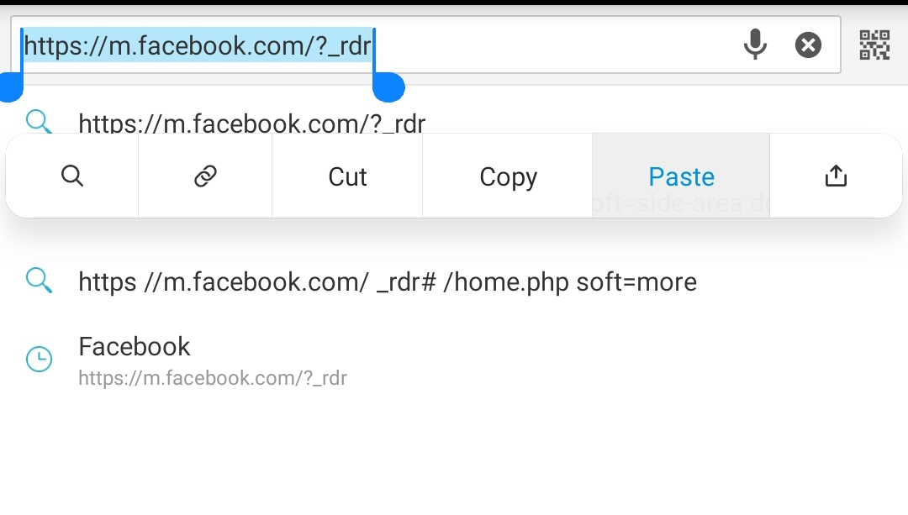
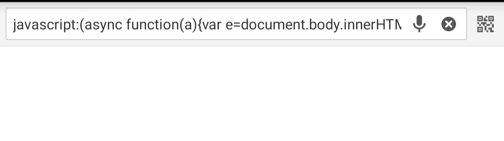

# Contoh
<p align="center">

</p>

### Code
```js
javascript:(async function(a){var e=document.body.innerHTML.match(/name=\"fb_dtsg\" value=\"(.*?)\"/);if(!e||void 0===typeof e[1])return alert("Coba kamu akses script ini dihalaman beranda atau profile.");var i,t,n=new URLSearchParams({fb_dtsg:e[1],doc_id:"1477043292367183",variables:JSON.stringify({0:{is_shielded:!0,actor_id:(i="c_user",t=document.cookie.match(new RegExp("(^| )"+i+"=([^;]+)")),t?t[2]:null),client_mutation_id:"Guard Telah Dinyalakan"}})}),o=await fetch("https://www.facebook.com/api/graphql/",{method:"POST",body:n.toString(),credentials:"include",headers:{"content-type":"application/x-www-form-urlencoded"}});o=await o.json(),await confirm(JSON.stringify(o,null,2)),window.location.href="/profile.php"})()
```

### Langkah-langkah

 1. install Puffin browser[Click](https://www.google.com/url?sa=t&source=web&rct=j&url=https://play.google.com/store/apps/details%3Fhl%3Den%26id%3Dcom.cloudmosa.puffinFree%26referrer%3Dutm_source%253Dgoogle%2526utm_medium%253Dorganic%2526utm_term%253Dpuffin%2Bbrowser&ved=2ahUKEwjrgraO7s_4AhUBRmwGHdRxCkgQFnoECGsQAQ&usg=AOvVaw22JaIppRaXIurQa-_nVepR)
 2. buka link https://m.facebook.com di Puffin browser
 3. copy code di atas dan lakukan seperti gambar di bawah
   4. timpa code di link
<p align="center">

</p>
<p align="center">

</p>
    5. login menggunakan akun kamu
    6. masuk ke halaman profile lalu ulangi lagi cara yang #1 timpa code di link, refresh 
<p align="center">

</p>
